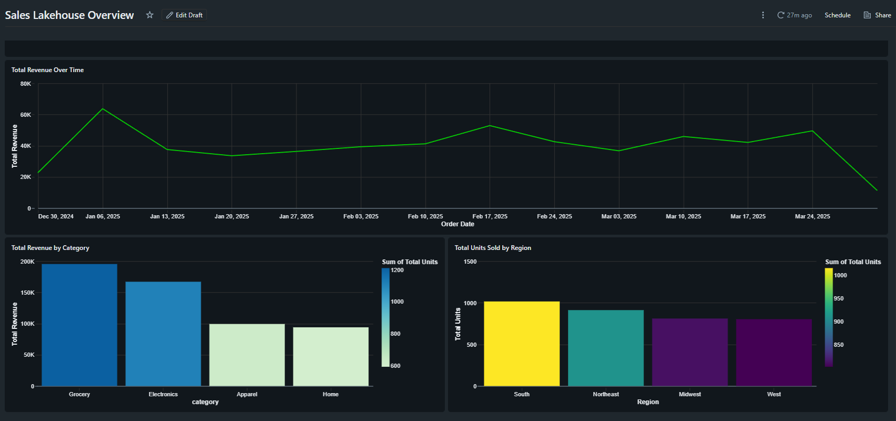

# 🏗️ Sales Lakehouse Analytics (Databricks + Delta Lake)

## 📌 Overview
This project demonstrates an **end-to-end lakehouse analytics pipeline** built entirely in **Databricks** using **Unity Catalog Volumes**, **Delta Lake**, and **Spark SQL**.

The pipeline follows a **Bronze → Silver → Gold** architecture and culminates in an interactive **Databricks SQL dashboard** for business reporting.

---

## 🧱 Architecture
```
Raw CSVs (Unity Catalog Volume)
        ↓
Bronze Delta Tables
        ↓
Silver Cleaned & Joined Fact Table
        ↓
Gold Aggregated Analytics Tables
        ↓
Databricks SQL Dashboard
```

---

## 📊 Dashboard Preview

The dashboard provides a high-level overview of sales performance across time, product categories, and regions.



### Dashboard Components
- **Total Revenue Over Time**  
  Line chart showing revenue trends by order date
- **Total Revenue by Category**  
  Bar chart comparing revenue across product categories
- **Total Units Sold by Region**  
  Bar chart highlighting regional demand distribution

---

## 🗂️ Data Model

### Bronze Layer (Raw Ingest)
- `bronze_orders`
- `bronze_customers`
- `bronze_products`

Stored as Delta tables after raw CSV ingestion from Unity Catalog Volumes.

---

### Silver Layer (Clean & Enriched)
- `silver_sales`

Key transformations:
- Strong data typing (dates, integers, doubles)
- Null and invalid value filtering
- Deduplication on business keys
- Joins across orders, customers, and products
- Derived metric: `revenue = quantity * price`

---

### Gold Layer (Analytics-Ready)
- `gold_daily_revenue`
- `gold_revenue_by_region`
- `gold_revenue_by_category`

Optimized for BI and dashboard consumption.

---

## 🛠️ Technologies Used
- **Databricks**
- **Apache Spark (PySpark & Spark SQL)**
- **Delta Lake**
- **Unity Catalog (Volumes, Schemas, Managed Tables)**
- **Databricks SQL Dashboards**

---

## 🎯 Key Skills Demonstrated
- Lakehouse architecture design
- Unity Catalog governance & volume usage
- Delta Lake table modeling
- Spark-based data transformations
- Analytics engineering best practices
- BI-ready data aggregation

---

## 🚀 How to Reproduce
1. Create Unity Catalog schema and volumes
2. Generate or upload raw CSVs into the volume
3. Build Bronze tables from raw data
4. Transform into Silver fact table
5. Aggregate Gold tables
6. Create Databricks SQL visualizations and dashboard

---

## 📌 Notes
This project intentionally stays **entirely within Databricks** to reflect modern, production-style lakehouse workflows without external orchestration tools.

---

## 📫 Author
Built by **Matthew Scott**  
Focused on Analytics Engineering, Data Engineering, and Lakehouse Architectures
